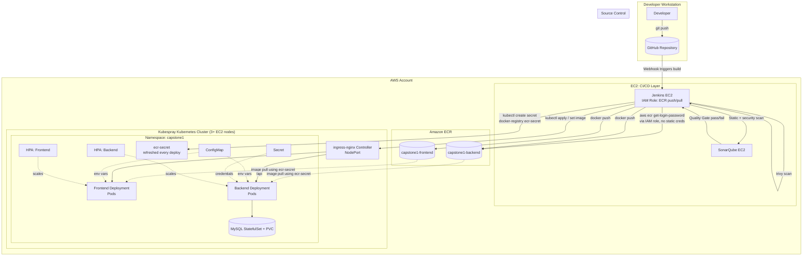

# Deployment Architecture (AWS Edition)

## Component Notes

- **IAM Role (EC2 instance profile)**: attached to the Jenkins EC2 instance, grants `ecr:GetAuthorizationToken`,
  `ecr:BatchCheckLayerAvailability`, `ecr:PutImage`, `ecr:InitiateLayerUpload`, etc. No AWS access keys are
  stored anywhere in Jenkins.
- **ecr-secret**: a Kubernetes `docker-registry` Secret containing a short-lived ECR token. kubelet does **not**
  automatically inherit the EC2 instance's IAM role, so pods need this Secret referenced via `imagePullSecrets`
  to pull from ECR. ECR tokens expire in ~12 hours, so the pipeline refreshes this Secret on every deploy —
  making the pipeline self-healing against expired tokens.
- **Ingress**: single entry point (NodePort-backed), routes `/` to the frontend Service and `/api` to the backend.
- **Database tier**: MySQL StatefulSet with a PersistentVolumeClaim. Kubespray ships no default StorageClass,
  so a provisioner (e.g. `local-path-provisioner`) must be installed first — see README §7.
- **Zero downtime**: `maxUnavailable: 0`, `maxSurge: 1` rolling update strategy + readiness probes.
