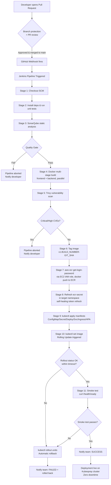

# CI/CD Pipeline Flow (AWS Edition)

## Trigger & Notification Summary

| Event | Mechanism |
|---|---|
| Code pushed / PR merged | GitHub webhook -> Jenkins `githubPush` trigger |
| Build status | `emailext` (or Slack) notification on success/failure |
| Quality gate result | SonarQube webhook -> Jenkins `waitForQualityGate` |
| ECR auth | Jenkins EC2 IAM role -> `aws ecr get-login-password` (no static keys) |
| Pod image pull | `ecr-secret` (docker-registry Secret), refreshed every deploy |
| Deployment failure | Automatic `kubectl rollout undo` + failure notification |
